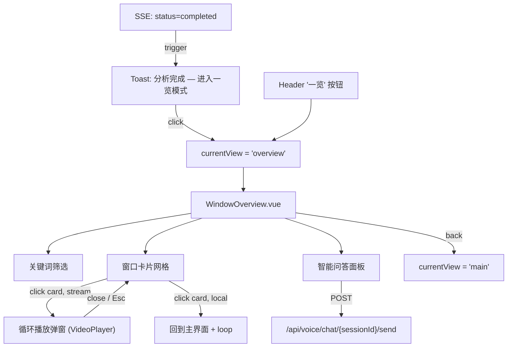

# 窗口一览模式（Window Overview）设计文档

> 分支：`feature/window-overview`，基于 `feature/pipeline-latency-opt-v2` 的 `0146f97`

---

## 版本历史

| 版本 | Commit | 内容 |
|------|--------|------|
| V1 | `22a6f2f` | 基础功能：窗口网格、关键词筛选、流模式循环播放弹窗、分析完成 Toast 提示 |
| V2 | `e24f64f` | UI 优化 + 智能问答面板：卡片重设计、动画、SVG 图标、右侧 Chat 面板 |

---

## 功能概览

分析完成后，用户可进入「窗口一览」模式，在一个全屏界面中浏览、搜索、播放所有分析窗口。

### 核心功能

1. **窗口网格** — 响应式 CSS Grid 展示所有分析窗口卡片，可无限下滑
2. **关键词筛选** — 实时搜索，按 summary 文本内容过滤，匹配词高亮
3. **循环播放** — 点击卡片后进入循环播放（流模式弹窗播放，本地模式回到主界面播放）
4. **智能问答** — 右侧滑出面板，基于分析内容进行 AI 对话

---

## 架构



---

## 文件结构

| 文件 | 职责 |
|------|------|
| `frontend/src/components/WindowOverview.vue` | 一览模式完整组件（网格、搜索、Chat、弹窗） |
| `frontend/src/App.vue` | 视图路由、Toast 提示、Header 按钮、事件处理 |

### WindowOverview.vue

**Props**

| Prop | 类型 | 说明 |
|------|------|------|
| `summaries` | `Array<{ window_id, start_time, end_time, summary }>` | 所有分析窗口 |
| `session` | `Object` | 当前会话对象 |
| `mode` | `'local' \| 'stream'` | 视频模式 |

**Events**

| Event | 参数 | 说明 |
|-------|------|------|
| `back` | — | 返回主界面 |
| `seekToWindow` | `windowId: number` | 本地模式：回到主界面并进入指定窗口循环 |

### App.vue 新增部分

- `currentView` 扩展为 `'select' | 'stream-input' | 'main' | 'overview'`
- SSE `onmessage` 中 `status === 'completed'` 时触发 Toast（10 秒自动消失）
- Header 新增「一览」按钮（`summaries.length > 0 && !isProcessing` 时显示）
- `enterOverview()` / `handleOverviewBack()` / `handleOverviewSeekToWindow()` 三个处理函数

---

## UI 设计细节（V2）

### 页面布局

```
┌─────────────────────────────────────────────────────┐
│ [← 返回]  窗口一览  (5/12)              ⏱ 03:00    │  Header
├─────────────────────────────────────────────────────┤
│ [🔍 搜索窗口内容...]                  [💬 智能问答] │  Toolbar
├──────────────────────────────────┬──────────────────┤
│                                  │  🤖 智能问答     │
│  ┌────────┐  ┌────────┐         │                  │
│  │ #0     │  │ #1     │         │  💬 关于这些分析  │
│  │ 00:00  │  │ 00:15  │  ...    │  窗口有什么想了  │
│  │ summary│  │ summary│         │  解的？           │
│  └────────┘  └────────┘         │                  │
│                                  │  [总结主要发现]  │
│  ┌────────┐  ┌────────┐         │  [关键操作步骤]  │
│  │ #2     │  │ #3     │  ...    │  [异常情况]      │
│  └────────┘  └────────┘         │                  │
│            Grid Area             │  [输入框] [发送] │
└──────────────────────────────────┴──────────────────┘
```

### 卡片设计

- **顶部 accent 线**：2px 渐变线（`accent-primary → accent-secondary`），hover 时显示
- **索引标识**：`#0`，使用 mono 字体 + accent 颜色
- **时间范围**：`00:00 – 00:15`，mono 字体 + tertiary 颜色
- **时长条**：3px mini-bar，宽度按该窗口时长占最长窗口的比例
- **摘要文本**：截断 140 字，搜索关键词用 `<mark>` 高亮

### 动画

| 元素 | 动画 | 参数 |
|------|------|------|
| 卡片列表 | staggered fade-in | 每张延迟 40ms，`translateY(12px) → 0` |
| 弹窗 | scale + fade | `scale(0.95) → 1`，0.25s ease |
| Chat 面板 | slide-in | `width: 0 → 360px`，0.25s ease |
| 打字指示器 | bouncing dots | 3 个圆点，1.2s 循环 |

### 快捷键

- `Esc` — 关闭循环播放弹窗

---

## 智能问答面板

### 交互设计

- 通过 Toolbar 右侧「💬 智能问答」按钮切换，面板从右侧滑入（360px 宽）
- 面板含：消息列表 + 底部输入框 + 发送按钮
- 空状态显示三个预设问题 chip，点击即发送

### 后端接口

复用已有的对话 API：

```
POST /api/voice/chat/{sessionId}/send
Body: { role: "user", content: "...", timestamp: ... }
Response: { success: true, response: { content: "..." } }
```

该接口会自动从 MySQL 中获取当前 session 的手术上下文（SurgR1 分析结果、GLM 摘要等），作为 LLM 的上下文参与回答。

### 预设问题

| Chip 文本 | 发送内容 |
|-----------|---------|
| 总结主要发现 | `总结所有窗口的主要发现` |
| 关键操作步骤 | `哪些窗口涉及关键操作步骤？` |
| 异常情况 | `有没有需要注意的异常情况？` |

---

## 循环播放弹窗

### 流模式（stream）

弹窗内嵌 `VideoPlayer` 组件，传入 `loopWindow` prop：

```javascript
{
  window_id: activeWindow.window_id,
  start_time: activeWindow.start_time,
  end_time: activeWindow.end_time
}
```

VideoPlayer 内部通过 `/api/analysis/frames-batch/` 加载帧并循环播放。

### 本地模式（local）

点击卡片 → emit `seekToWindow(windowId)` → App.vue 切回主界面 → `handleSeekToWindow()` 设置 `loopWindow` → HTML5 video 循环播放。

---

## 样式规范

全部使用 `main.css` 中定义的 CSS 变量，保持风格统一：

| 用途 | 变量 |
|------|------|
| 卡片背景 | `--bg-secondary` |
| hover 边框 | `--accent-primary` |
| hover 光晕 | `--shadow-glow` / `--accent-glow` |
| 文字层级 | `--text-primary` / `--text-secondary` / `--text-tertiary` |
| 圆角 | `--radius-sm` / `--radius-md` / `--radius-lg` |
| 等宽字体 | `--font-mono`（时间、索引） |

---

## 后续迭代方向

- [ ] 卡片缩略图：从 `/api/analysis/frames-batch/` 获取首帧作为卡片预览图
- [ ] 多关键词筛选：支持空格分隔多个关键词（AND 逻辑）
- [ ] 窗口标签/分类：按手术阶段自动分组
- [ ] 导出功能：从一览模式直接选中窗口导出视频片段
- [ ] Chat 上下文增强：将当前筛选后的窗口摘要作为额外 context 注入 prompt
- [ ] 本地模式弹窗播放：用 `<video>` 元素实现本地视频的弹窗内循环播放（避免切换视图）
